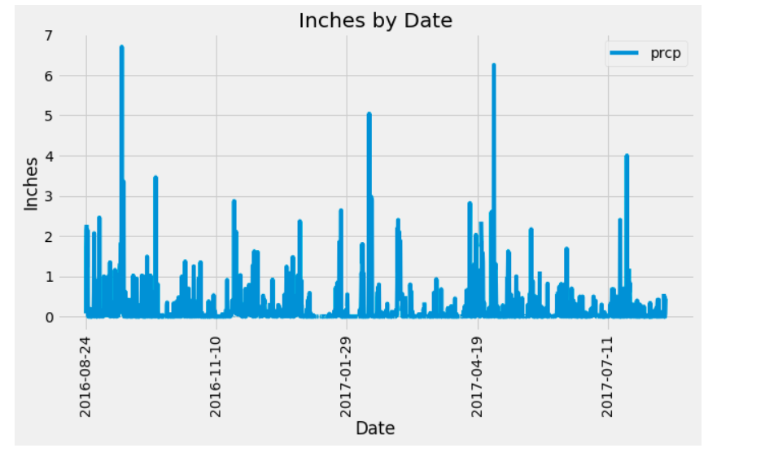
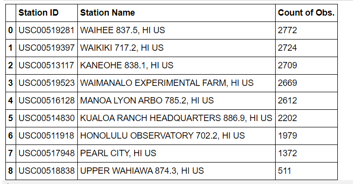
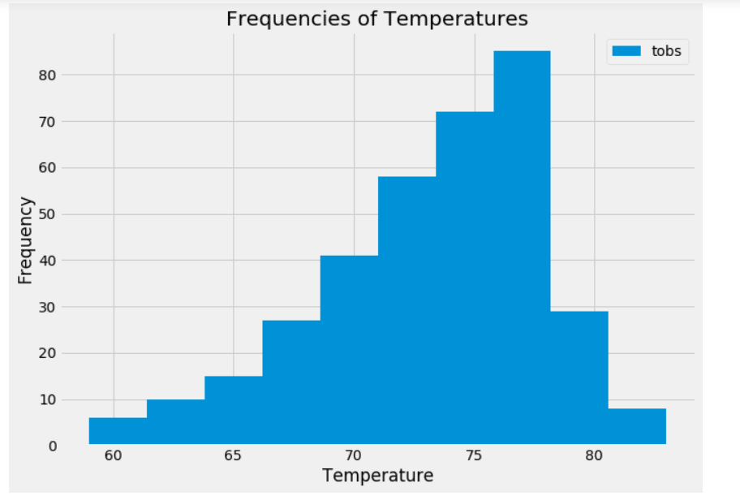
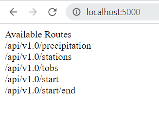
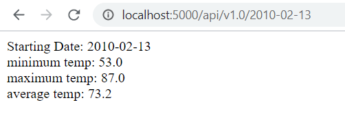

# Hawaii-Weather-Analysis

In this challenge, I tested myself with SQLAlchemy and Flask. First, I wanted to use SQLAlchemy to do exploratory analysis on climate measurement stations. To do this, I worked inside a Jupyter Notebook and connected with SQLAlchemy to a sqlite file that held temperature and precipitaion observations from measurement stations around Hawaii. I used Pandas and matplotlib to create visualizations. The first visualization was a bar chart that looked at the last year's worth of observations. Below is that graph. 

The next question to determine was how many observations per station (which was the most active). Below is a table of the station ID, Name, and then the observation count.

The most active station, WAIHEE 837.5, HI US and I found that the minimum temperature was: 54.0 degrees, its maximum temperature was: 85.0 degrees, and its average temperature was: 71.7 degrees. For further analysis, I created a temperature vs frequency bar chart of station WAIHEE. Below is that visualization.

Part 2 of the challenge is for me to work with a Flask server. I wanted to use Flask API to create basic routes for me to be able to do some filtering of the sqlite data. I started with a home route that will list the possible routes. I wanted five routes: first route would show all of the date and precipitation observations, the second route would show a list of the ID and station names, the third would show the date and temp observations, fourth would filter the data by the user entered date, and the fifth would filter on start and end date. Below is an image of those routes in a browser.

Also included is one example of the filtering. This was done using the user inputed date and outputs the min, max, and average temperature for all the observations from the time.

